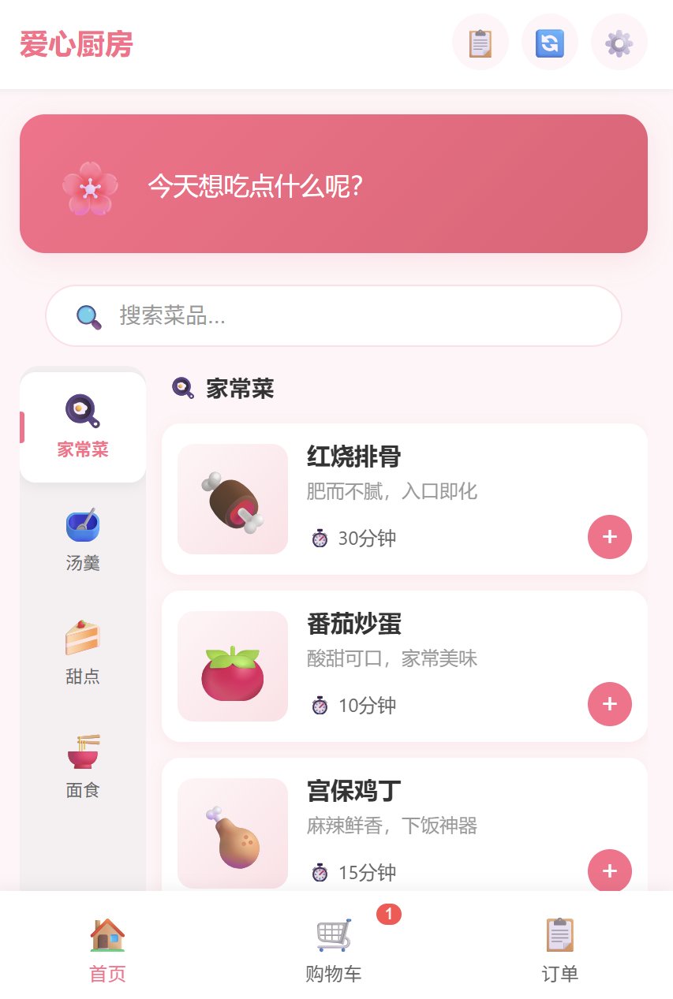
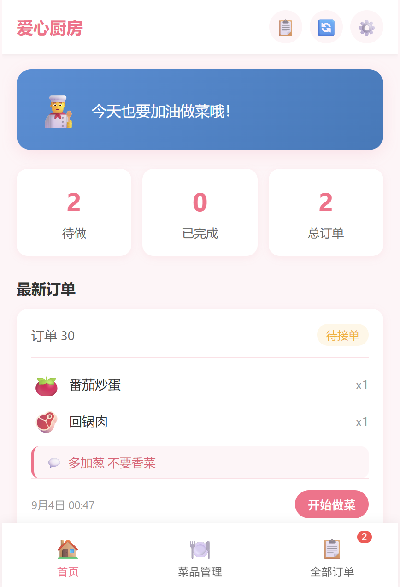

<p align="center">
  
</p>

<h1 align="center">爱心厨房 💕</h1>

<p align="center">
  情侣专属点餐小程序 —— <b>TA 负责点菜，你负责下厨</b>
  <br/>
  <sub>一方在厨房掌勺，另一方在线随心选菜下单，柴米油盐也能甜到心里</sub>
</p>

<p align="center">
  
  
  
  
</p>

<br />

## 🌟 项目简介

两个人一起生活，最常纠结的就是一句 —— **“今天吃什么？”**

「爱心厨房」是一款为情侣打造的专属点餐小程序：

- 👨‍🍳 **男方（厨师）**：管理今天的家常菜单、设置菜品规格，看菜下单，做完标记完成；

- 👩‍🍳 **女方（点餐方）**：像逛超市一样浏览菜单、选规格、加购物车、一键下单，把“想吃”亲手递给对方。

绑定情侣后，两个人的菜单**实时同步**、自动取并集去重，一方上新菜另一方立刻收到提醒，温暖又高效。

<br />

## 📱 界面预览

<p align="center">
  
  &nbsp;&nbsp;&nbsp;&nbsp;
  
</p>
<p align="center">
  <sub>👩‍🍳 点餐方 · 选菜加购</sub>&nbsp;&nbsp;&nbsp;&nbsp;&nbsp;&nbsp;&nbsp;&nbsp;<sub>👨‍🍳 厨师 · 接单做菜</sub>
</p>

<br />

## ✨ 功能亮点

| 功能                  | 说明                                  |
| :------------------ | :---------------------------------- |
| 💞 **情侣绑定**         | 6 位邀请码一分钟生成，24 小时内有效；双向绑定、随时可解绑     |
| 🧑‍🤝‍🧑 **菜单同步**   | 绑定后双方菜品**取并集去重**同步；解绑后各自数据不相扰、完好保留  |
| 🔔 **实时提醒**         | 一方新增 / 删除菜品，另一方首页自动刷新并弹窗提示          |
| 🛒 **淘宝闪购式购物车-小程序** | 首页底部常驻数量角标，点击展开菜品详情，可一键清空           |
| 🍔 **选规格-小程序**      | 支持分量、辣度等自定义规格；有规格的菜显示「选规格」，无规格直接 +1 |
| 📦 **点餐下单**         | 点餐方下单 → 厨房接单 → 完成后双向通知，流程闭环         |
| 🍳 **自带菜单**         | 内置家常菜、汤羹、甜品、面食等多类菜品，新用户开箱即用         |
| 👤 **账号体系-小程序**     | 手机号 + 6 位密码登录，支持头像 / 昵称编辑、修改密码、注销账号 |

<br />

## 🛠️ 技术栈

**主阵地 —— 微信小程序 + 微信云开发（零服务器）**

- `WXML / WXSS / JavaScript` —— 原生小程序开发，无需额外框架

- **微信云开发（CloudBase）** —— 云函数 + 云数据库，开箱即用、免运维

  - 云存储 / 云数据库：`users`、`dishes`、`orders`、`notifications` 集合

  - 云函数：`login`、`partner`、`dish`、`order`、`notification`

**可选配套 —— 网页版 + Node 后端**

- 网页端：原生 `HTML / CSS / JS`（单页应用）

- 服务端：`Express + MySQL`（登录、菜品、购物车、订单、邀请绑定、通知等 RESTful API）

<br />

## 📁 项目结构

```
love-kitchen
├── miniapp/                      # 📱 微信小程序（核心）
│   ├── cloudfunctions/           #    云函数
│   │   ├── login/                #     用户注册/登录/资料/改密
│   │   ├── partner/              #     情侣绑定/解绑/邀请码
│   │   ├── dish/                 #     菜品增删改查 + 配对去重
│   │   ├── order/                #     创建/查询/更新订单
│   │   └── notification/         #     实时通知读写
│   ├── pages/                    #    页面
│   │   ├── index/                #     登录首页（选角色 + 手机号密码）
│   │   ├── bind/                 #     情侣绑定（生成/输入邀请码）
│   │   ├── boy-home/             #     男方（厨师）首页 · 接单看菜
│   │   ├── boy-dishes/           #     男方菜品管理（增删改 + 规格设置）
│   │   ├── girl-home/            #     女方（点餐方）首页 · 菜单购物车
│   │   ├── cart/                 #     购物车
│   │   ├── orders/               #     订单列表
│   │   └── settings/             #     设置 / 个人资料 / 修改密码
│   ├── utils/                    #     api 封装、导航工具
│   ├── dishes-import.json        #    内置默认菜品数据
│   ├── app.js / app.json / app.wxss
│   └── project.config.json
│
├── server/                       # ⚙️ 可选网页版 Node 后端（Express + MySQL）
│   ├── index.js                  #    RESTful API
│   ├── db.js                     #    数据库连接
│   └── schema.sql                #    建表语句
│
├── index.html                    # 🌐 可选网页版前端（单页）
├── styles.css
├── app.js / api.js
└── README.md
```

<br />

## 🚀 快速开始（微信小程序）

### 1. 导入项目

1. 下载并安装 [微信开发者工具](https://developers.weixin.qq.com/miniprogram/dev/devtools/download.html)
2. 打开工具 → 导入项目 → 选择 `miniapp/` 目录
3. 填入自己的小程序 `AppID`

### 2. 开通云开发

1. 点击工具栏 **「云开发」** → 开通环境（免费额度即可）
2. 将下文的 `env` 替换成你的**云环境 ID**

```javascript
// miniapp/app.js
wx.cloud.init({
  env: 'cloud1-d4ggqiq106a8a7e74', // ← 替换为你的云环境 ID
  traceUser: true
});
```

### 3. 创建数据库集合

在云开发控制台创建 4 个集合：`users`、`dishes`、`orders`、`notifications`.

### 4. 部署云函数

- 在开发者工具中对 `cloudfunctions/` 下每个云函数文件夹 **右键 → 创建并部署：云端安装依赖**

- 依次部署：`login` → `partner` → `dish` → `order` → `notification`

### 5. 导入内置菜单（可选）

若需新用户开箱即用自带菜品，可在云数据库中把 `dishes-import.json` 的数据导入 `dishes` 集合（每个菜品**不填** **`chefPhone`** **字段**，即为系统默认菜，对所有用户可见）。

### 6. 编译运行

点击「编译」即可在模拟器中体验。真机预览需在开发者工具中开启「不校验合法域名」或配置云开发域名白名单。

<br />

## 🎮 玩法流程

```
女方（点餐方）                         男方（厨师）
───────────────────────          ───────────────────────
手机号 + 密码 登录                手机号 + 密码 登录
   │                                  │
生成 6 位邀请码 ──绑定──▶ 输入邀请码（24h 有效）
   │                                  │
浏览菜单（选规格、加购物车）      管理菜单（增删菜、设规格）
   │                                  │
下单 ───────── 新单弹窗提示 ──────▶ 接单、制作
   │◀──────── 完成通知 ────────── 标记完成
```

### 💞 绑定后的同步规则

- **绑定前各自新增的菜** → 绑定后依然存在，双方菜单**取并集并去重**；

- **绑定后一方增/删/改** → 双方菜品同步更新，另一方实时收到弹窗提醒；

- **解绑后** → 双方菜品各自保留、互不影响，安心无负担。

<br />

<br />

## 🌐 网页版（可选）

项目根目录附带一个纯前端 + Node/MySQL 的网页演示版，如需运行：

```bash
cd server
npm install
# 在 db.js 中配置 MySQL 连接，并执行 schema.sql
node index.js
```

然后直接用浏览器打开根目录的 `index.html` 即可体验。

> 💡 提示：网页版为轻量演示，**主力版本是** **`miniapp/`** **微信小程序**，功能最完整。

<br />

<br />

<br />

## 📄 License

本项目采用 **MIT** 协议，欢迎自由使用与二次开发。

***

<p align="center">
  made with ❤️ for 每一个为爱下厨的人
</p>
